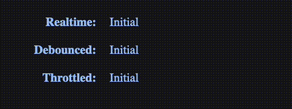

<h1 align="center">
  react-relaxed 🐌 
</h1>

<p align="center">
  React Hooks for debouncing and throttling inputs or any other changing value
</p>

<p align="center">
  <a href="https://www.npmjs.com/package/react-relaxed"></a>
  <a href="https://github.com/noahflk/react-relaxed/blob/master/LICENSE"></a>
</p>

---

## Installation

### NPM

```
npm install react-relaxed
```

### Yarn

```
yarn add react-relaxed
```

## Demo

Try with [Codesandbox](https://codesandbox.io/s/react-relaxed-demo-0iyrs)

<p align="center">
  
</p>

## Usage

### Debounce

Delays updating the returned `debouncedValue` variable until a given number of miliseconds have elapsed since the last time the `value` argument was changed.

```jsx
import { useState } from "react";
import { useDebounce } from "react-relaxed";

const App = () => {
  const [value, setValue] = useState("initial value");
  const [debouncedValue] = useDebounce(value, 500);

  return (
    <div>
      <input value={value} onChange={(event) => setValue(event.target.value)} />
      <p>{value}</p>
      <p>{debouncedValue}</p>
    </div>
  );
};
```

With `useDebounceState` you do not need a seperate `useState` hook to keep track of the state. Apart form that, it's the same as `useDebounce`.

```jsx
import { useDebounceState } from "react-relaxed";

const App = () => {
  const [value, setValue, debouncedValue] = useDebounceState("initial value", 500);

  return (
    <div>
      <input value={value} onChange={(event) => setValue(event.target.value)} />
      <p>{value}</p>
      <p>{debouncedValue}</p>
    </div>
  );
};
```

### Throttle

The returned `throttledValue` gets updated at must once every given number of miliseconds, assuming the `value` argument changes more often than that.

```jsx
import { useState } from "react";
import { useThrottle } from "react-relaxed";

const App = () => {
  const [value, setValue] = useState("initial value");
  const [throttledValue] = useThrottle(value, 500);

  return (
    <div>
      <input value={value} onChange={(event) => setValue(event.target.value)} />
      <p>{value}</p>
      <p>{throttledValue}</p>
    </div>
  );
};
```

With `useThrottleState` you do not need a seperate `useState` hook to keep track of the state. Apart form that, it's the same as `useThrottle`.

```jsx
import { useThrottleState } from "react-relaxed";

const App = () => {
  const [value, setValue, throttledValue] = useThrottleState("initial value", 500);

  return (
    <div>
      <input value={value} onChange={(event) => setValue(event.target.value)} />
      <p>{value}</p>
      <p>{throttledValue}</p>
    </div>
  );
};
```

## API

### useDebounce

```js
const [debouncedValue] = useDebounce(value, delay, {
  onChange,
  leading,
  trailing,
  maxWait,
});
```

#### Returns

- `debouncedValue: any`
  - The debounced value

#### Arguments

- `value: any`
  - Input value that gets debounced
- `delay: number`
  - Number of miliseconds that must have elapsed since the last time `value` was changed before `debouncedValue` gets updated
- `leading: boolean = false`
  - Update `debouncedValue` at the leading edge
  - Update takes place **before** each `delay`
- `trailing: boolean = true`
  - Update `debouncedValue` at the leading edge
  - Update takes place **after** each `delay`
- `onChange: fn(value) => void`
  - Input value that gets debounced
- `maxWait: number`
  - Number of miliseconds after which `debouncedValue` gets updated, even if there is continous input

### useDebounceState

```js
const [value, setValue, debouncedValue] = useDebounceState(initialValue, delay, {
  onChange,
  leading,
  trailing,
  maxWait,
});
```

#### Returns

- `value: any`
  - Value state
- `setValue: React.SetStateAction`
  - Sets / updates value state
- `debouncedValue: any`
  - The debounced value

#### Arguments

- `initialValue: any`
  - Initial value for state
- `delay: number`
  - Number of miliseconds that must have elapsed since the last time `value` was changed before `debouncedValue` gets updated
- `leading: boolean = false`
  - Update `debouncedValue` at the leading edge
  - Update takes place **before** each `delay`
- `trailing: boolean = true`
  - Update `debouncedValue` at the leading edge
  - Update takes place **after** each `delay`
- `onChange: fn(value) => void`
  - Input value that gets debounced
- `maxWait: number`
  - Number of miliseconds after which `debouncedValue` gets updated, even if there is continous input

### useThrottle

```js
const [throttledValue] = useThrottle(value, delay, {
  onChange,
  leading,
  trailing,
});
```

#### Returns

- `throttled: any`
  - The throttled value

#### Arguments

- `value: any`
  - Input value that gets throttled
- `delay: number`
  - Number of miliseconds between every update of `throttledValue`, provided `value` argument changes more often than that
- `leading: boolean = false`
  - Update `debouncedValue` at the leading edge
  - Update takes place **before** each `delay`
- `trailing: boolean = true`
  - Update `debouncedValue` at the leading edge
  - Update takes place **after** each `delay`
- `onChange: fn(value) => void`
  - Input value that gets debounced

### useThrottleState

```js
const [value, setValue, throttledValue] = useThrottleState(initialValue, delay, {
  onChange,
  leading,
  trailing,
});
```

#### Returns

- `value: any`
  - Value state
- `setValue: React.SetStateAction`
  - Sets / updates value state
- `throttled: any`
  - The throttled value

#### Arguments

- `initialValue: any`
  - Initial value for state
- `delay: number`
  - Number of miliseconds that must have elapsed since the last time `value` was changed before `throttledValue` gets updated
- `leading: boolean = false`
  - Update `throttledValue` at the leading edge
  - Update takes place **before** each `delay`
- `trailing: boolean = true`
  - Update `debouncedValue` at the leading edge
  - Update takes place **after** each `delay`
- `onChange: fn(value) => void`
  - Input value that gets debounced

## Other solutions

[use-debounce](https://github.com/xnimorz/use-debounce)

## Credits

This package used [create-react-hook](https://github.com/Hermanya/create-react-hook) CLI for setting up the build proccess.

## License

`react-relaxed` is available under the MIT license. See the [LICENSE](LICENSE) file for more info.
